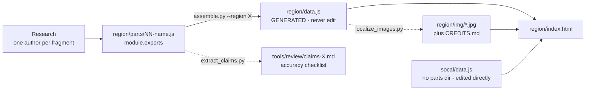
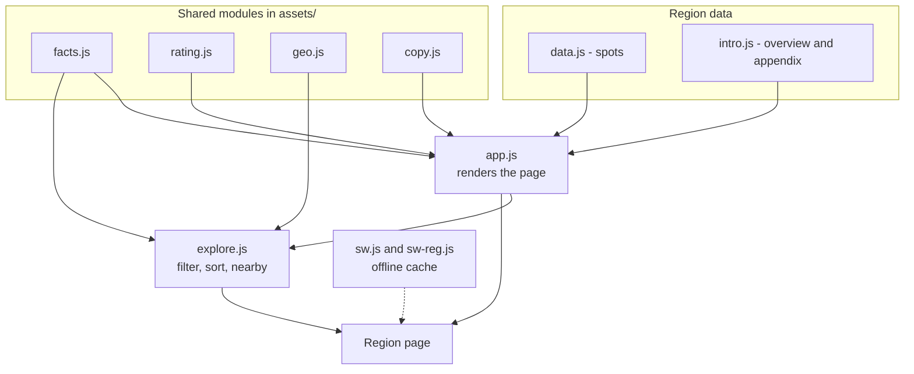

# Wander USA 2026

A field handbook for four US travel regions, published as a static site.
**Live: <https://andyuneducated.github.io/wander-usa-2026-guides/>**

It is not an itinerary planner. Every entry answers the same four questions about
a place you have already decided to go near: *what is there to see, how do you
move through it, how long does it take, and can you actually get in today.*
Photo spots are secondary and live in a collapsed section of each card.

Two properties drive most of the design:

- **The reader is often offline.** Most roads in Yellowstone have no signal, so
  the site is a PWA that keeps what you browsed at home readable on the road.
- **The reader is often in a car.** Hard facts (visit duration, price, hours,
  booking) are extracted out of the prose into a scannable strip, and attraction
  titles copy to the clipboard on click for pasting into Google Maps.

> **Language policy.** The published guide content is Chinese, by design and
> permanently. Everything else — code, comments, documentation, commit messages —
> is English. See [Conventions](#conventions).

## Contents

| Region | Sub-regions | Spots | Photo spots | Images |
| --- | ---: | ---: | ---: | ---: |
| `nyc` — New York + New England | 7 | 79 | 207 | 235 |
| `yellowstone` — Yellowstone + Grand Teton | 7 | 67 | 183 | 195 |
| `dc` — Washington DC + Philadelphia | 7 | 54 | 168 | 161 |
| `socal` — Southern California | 6 | 47 | 141 | 135 |

`nyc`, `yellowstone` and `dc` carry the full field set (visitor-value rating,
`tour`, visit duration). `socal` predates that schema and is deliberately left on
the older shape; it gets UI updates but no data rewrite.

## How the data gets in

Region data is hand-researched against official sources, one fragment file per
sub-region, then assembled into a single `data.js` per region.



`assemble.py` sorts spots north-to-south by latitude and renumbers the `n` field
so card numbers and map pins always agree. Because `data.js` is generated, edits
made there are lost on the next assemble — change the fragment instead.

The fragment format is specified in **[`tools/SCHEMA.md`](tools/SCHEMA.md)**,
which is the contract for anyone adding or revising data. Read it before touching
`parts/*.js`.

## How a page is built

There is no bundler and no framework. Each page is plain HTML that loads Leaflet,
its region's data, and a handful of small IIFE modules in dependency order.



| File | Responsibility |
| --- | --- |
| `assets/app.js` | Renders sub-region sections, spot cards, maps, the folded appendix and the search box. The largest module. |
| `assets/explore.js` | The sticky filter/sort toolbar, plus the "nearest to me" and "along the way" panels. |
| `assets/facts.js` | Parses visit duration, ticket price, hours and booking status out of the Chinese prose so filters and the quick-facts strip have structured values to work with. |
| `assets/rating.js` | Star SVGs and the tier wording behind each score. |
| `assets/geo.js` | Geolocation and distance, shared by region pages and the all-spots table so both rank identically. |
| `assets/copy.js` | Click a title to copy it for a Maps search. |
| `assets/all.js` | Powers `all.html`, the cross-region table. |
| `sw.js` / `assets/sw-reg.js` | Offline caching: cache-first shell, stale-while-revalidate documents, cache-on-use images. |

Pages: `index.html` (landing), `all.html` (every spot, cross-region), and
`<region>/index.html` ×4, which are generated by `tools/make_region_pages.py`.

## Working on it

The site is fully static, but it needs to be served over HTTP — `file://` breaks
the service worker, geolocation and `fetch`.

```bash
python3 -m http.server 8000     # then open http://localhost:8000/
```

| Task | Command |
| --- | --- |
| Rebuild a region after editing fragments | `python3 tools/assemble.py --region nyc` |
| Data integrity (fields, coordinates, images, ordering, links) | `python3 tools/check_all.py` |
| Unit tests (star maths, fact extraction, free/paid classifier) | `node tools/test_units.js` |
| Language policy (no Chinese in comments or docs) | `python3 tools/check_language.py` |
| Browser tests, desktop + mobile, all 6 pages | `python3 tools/test_pages.py` |
| Same, against the deployed site | `python3 tools/test_pages.py --base https://andyuneducated.github.io/wander-usa-2026-guides/` |
| Visual review screenshots → `tools/.shots/` | `python3 tools/screenshots.py` |
| Download remote images locally + write credits | `python3 tools/localize_images.py --region dc` |
| Find Commons images for a spot | `python3 tools/find_images.py "keyword"` |

`test_pages.py` deliberately force-opens every `<details>` and switches images to
eager loading, so it catches broken images hidden inside collapsed cards. It is
the slowest check (~7 min) and the one that matters most before a deploy.

Other tools: `verify_images.py` (Commons API + local file signatures),
`verify_coords.py` (Nominatim reverse-check for invented coordinates),
`snapshot_parts.py` (fragment snapshots, catches concurrent overwrites),
`reorder_north_south.py`, `sun.py`, `run_detached.py`.

## Conventions

| Rule | Why |
| --- | --- |
| Guide content is Chinese; code, comments, docs and commit messages are English. Enforced by `tools/check_language.py`. | The audience reads Chinese; the codebase should be readable by anyone. |
| Never edit `nyc/dc/yellowstone/data.js`. Edit `parts/*.js` and re-run `assemble.py`. | `data.js` is generated and will be overwritten. `socal/data.js` is the exception — it has no `parts/`. |
| Bump the asset version in **both** places when shipping front-end changes: the `?v=` stamp in every HTML file and `VERSION` in `sw.js`. | The service worker caches aggressively. Skipping this ships code that nobody sees. |
| Comments explain *why*, citing the failure that motivated the code. | The tricky parts here are layout and caching bugs that are invisible in the code itself. |
| One author per fragment file; write incrementally, never in one final batch. | Both rules were added after real losses — concurrent writes silently overwrote researched hours, and a batched run timed out and left nothing behind. |
| Commit explicit paths, not `git add -A`, while fragments are being written concurrently. | A half-finished fragment was once committed this way. |
| Colours derive from CSS variables in `:root`; translucent shades use `rgba(var(--x-rgb), a)`. | Recolouring the site is then a one-line change. |

## Known data gaps

Verified as unresolvable online as of 2026-09-06; each is marked as unconfirmed in
the data with a phone number, so no further desk research will help.

| Item | Situation |
| --- | --- |
| Green-Wood Cemetery October closing time | Never published. Sunset is 18:11–18:14, which falls exactly between the two plausible closing times. (718) 768-7300. |
| Old Faithful Inn closing date | Xanterra says 10/12, NPS says 10/18, both pages current. Affects only the late-October backup window. 307-344-7311. |
| Clay Butte Lookout 2026 season | Unverifiable; inferred from other facilities in the same forest district. (307) 527-6921, closed Wednesdays. |
| Blacktail Plateau Drive / Upper Terrace Drive closing | No published dates; only "no later than 11/1" can be inferred. 307-344-2117. |
| Berkeley Pit admission | Never officially published; third-party sources say $3 or $7. Bring $10 cash. |

## Attribution

Map tiles © Esri (Dark Gray Canvas). Photographs come from Wikimedia Commons under
their original licenses (mostly CC BY-SA / CC0 / Public Domain) and are used as
location-scouting reference; per-file attribution is in `<region>/img/CREDITS.md`.
